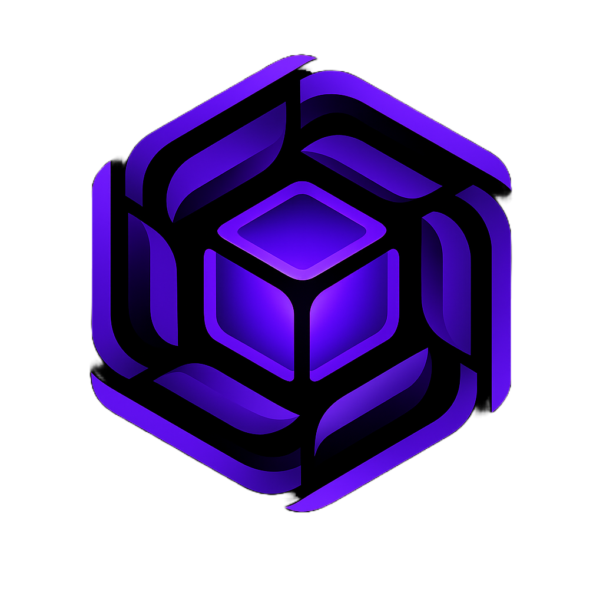

<p align="center">
  
</p>

<h1 align="center">Driftbox</h1>

<p align="center">
  <strong>Multiplayer Terraform. Like Figma, but for infrastructure.</strong>
</p>

<p align="center">
  <a href="#quick-start">Quick Start</a> &bull;
  <a href="#features">Features</a> &bull;
  <a href="#architecture">Architecture</a> &bull;
  <a href="ARCHITECTURE.md">Deep Dive</a> &bull;
  <a href="CONTRIBUTING.md">Contributing</a>
</p>

<p align="center">
  <a href="LICENSE"></a>
  
  
  
</p>

---

Multiple engineers edit the same Terraform codebase at the same time. Live cursors follow each person through the code. File locks prevent conflicts. When someone changes a VPC, everyone touching dependent resources gets notified instantly. An AI agent participates as another engineer in the workspace.

This isn't a text editor with a chat sidebar bolted on. It's a collaboration engine that understands infrastructure — resource dependencies, blast radius, drift detection — built into a full IDE.

<!-- Add a demo GIF/video here -->
<!--  -->

## Why This Exists

Infrastructure teams screen-share Terraform. One person drives, everyone else watches. PRs get stale because reviewers can't see what the author is looking at. Two engineers edit the same module without knowing, then spend an hour resolving conflicts.

Driftbox makes infrastructure editing multiplayer by default. You open a workspace, your teammates are already there. You see their cursors, their intent, their changes — as they happen.

## Features

### Real-Time Collaboration

| Capability | How It Works |
|---|---|
| **Live cursors** | Colored cursor bars + floating name labels in Monaco Editor. You see exactly where each teammate is typing. |
| **Text sync** | Debounced full-content broadcast (150ms). Your changes appear in everyone's editor. |
| **File locking** | Exclusive and soft locks with a queue. Request a lock, the holder gets notified. |
| **Intent signaling** | Declare what you're doing — exploring, implementing, debugging, ready for PR — so your team knows without asking. |
| **Activity status** | See who's idle, editing, running AI generation, or creating a PR. |
| **Dependency notifications** | Edit `aws_vpc.main` and everyone working on resources that reference it gets an instant warning. |

### 25 WebSocket Message Types

The collaboration protocol handles the full lifecycle of multiplayer infrastructure editing:

```
Presence:     file_open, file_close, ping, leave
Editing:      text_change, cursor_move, file_change
Sync:         files_updated, files_discarded
Locking:      acquire_lock, release_lock, request_lock, get_lock_status
              lock_files_for_pr, unlock_files_from_pr
Intent:       intent_change, pr_intent_change, activity_status_change
Team:         chat_message, typing, create_team_pr
Dependencies: update_dependencies, resource_changed, get_dependents,
              get_dependency_graph
```

### Terraform-Native IDE

- **HCL parser & programmatic editor** — surgically modify resource blocks, attributes, tags, and nested blocks without breaking syntax
- **Validation pipeline** — `terraform fmt` → `init` → `validate` on every change
- **Resource dependency graph** — visualize what depends on what, rendered with ReactFlow + Dagre
- **Drift detection** — compare deployed state against code
- **Multi-provider cost estimation** — AWS and DigitalOcean resource pricing
- **Natural language → Terraform** — describe infrastructure in English, get valid HCL via RAG pipeline

### Full IDE Experience

- **Monaco Editor** — VS Code's editor engine with HCL syntax highlighting, diagnostics, and inline diffs
- **File tree** — browse GitHub repos with git status indicators (modified/added/deleted)
- **Tabbed editing** — multi-file with dirty state, proposal diffs, accept/reject per-file
- **Integrated terminal** — shell access within the IDE
- **Staging panel** — git-style staging with diff preview before committing
- **Keyboard shortcuts** — configurable, with overlay reference
- **GitHub Actions** — trigger and monitor workflows from the IDE

### Team Infrastructure

- **Workspaces** — create teams, invite via email (SendGrid), share repos
- **RBAC** — Admin / Developer / Viewer with granular permissions
- **Team chat** — in-IDE messaging with code references (highlight code → share in chat)
- **Team PR builder** — stage changes, add contributors, create PRs collaboratively
- **Billing** — Stripe integration with free/team/enterprise tiers
- **Audit logging** — full trail of who did what, when

### AI Agent

- **Participates as a teammate** — generates Terraform code, proposed changes appear as file diffs
- **RAG pipeline** — crawls Terraform registry docs, embeds with Voyage AI, retrieves relevant context
- **File proposals** — AI suggests changes as accept/reject diffs, not direct edits
- **LLM failover** — falls back between Anthropic and OpenAI
- **MCP server** — Model Context Protocol integration for tool-augmented generation

### Desktop App

- **Electron wrapper** — native macOS/Windows/Linux app
- **Local filesystem sync** — teammate's AI-generated files write to your local disk automatically via `electronAPI`
- **GitHub OAuth** — native OAuth flow for desktop

## Quick Start

### Prerequisites

- Python 3.12+
- Node.js 18+
- Terraform CLI ([install](https://developer.hashicorp.com/terraform/install))
- A [Supabase](https://supabase.com) project (free tier works)
- An API key from [Anthropic](https://console.anthropic.com) or [OpenAI](https://platform.openai.com)

### 1. Clone & configure

```bash
git clone https://github.com/elijamesku/driftbox.git
cd driftbox
cp .env.example .env
```

Edit `.env` — you need at minimum: `SUPABASE_URL`, `SUPABASE_KEY`, `SUPABASE_DB_URL`, one LLM key, a GitHub OAuth app, and a JWT secret.

### 2. Database

Run [`supabase_auth_schema.sql`](supabase_auth_schema.sql) in your Supabase SQL editor.

### 3. Backend

```bash
pip install -r requirements.txt
uvicorn app.main:application --host 0.0.0.0 --port 8000 --reload
```

### 4. Frontend

```bash
cd frontend
npm install
npm run dev
```

Open [http://localhost:3000](http://localhost:3000).

### Docker

```bash
docker compose up --build
```

Starts the backend on port 8000. Run the frontend separately or add it to the compose file.

## Architecture

```
┌──────────────────────────────────────────────────────────────┐
│                        FRONTEND                               │
│                                                               │
│  Next.js 14 ─── Monaco Editor ─── Tailwind CSS               │
│       │              │                                        │
│  IDELayout      MonacoEditor.tsx                              │
│  ├─ Sidebar       ├─ HCL syntax highlighting                 │
│  ├─ EditorPane    ├─ Remote cursor decorations                │
│  ├─ ChatPanel     ├─ Inline diff (accept/reject)             │
│  ├─ Terminal      └─ Content widget name labels               │
│  ├─ StagingPanel                                              │
│  ├─ TeamPresence   useTeamCollaboration.ts                    │
│  └─ DependencyGraph  ├─ WebSocket connection management       │
│                       ├─ 25 message type handlers             │
│                       ├─ Reconnect with backoff               │
│                       └─ Local file sync (Electron)           │
│                                                               │
│  Electron (Desktop)                                           │
│  ├─ electronAPI.writeFile / deleteFile                        │
│  └─ Cross-machine file sync                                  │
└───────────────────────────┬──────────────────────────────────┘
                            │
              WebSocket + REST API
                            │
┌───────────────────────────┴──────────────────────────────────┐
│                        BACKEND                                │
│                                                               │
│  FastAPI + Uvicorn (async)                                    │
│                                                               │
│  ┌─────────────────────┐  ┌──────────────────────────────┐   │
│  │ TeamCollaboration   │  │ Terraform Engine             │   │
│  │ Manager             │  │                              │   │
│  │ ├─ team_connections │  │ editor.py                    │   │
│  │ ├─ team_presence    │  │ ├─ find_resource_block()     │   │
│  │ ├─ file_activity    │  │ ├─ _ensure_path_in_block()   │   │
│  │ ├─ cursor_positions │  │ ├─ _upsert_named_block()     │   │
│  │ ├─ file_locks       │  │ └─ apply_op_to_file()        │   │
│  │ ├─ lock_requests    │  │                              │   │
│  │ ├─ chat_messages    │  │ terraform.py                 │   │
│  │ ├─ resource_deps    │  │ ├─ fmt → init → validate     │   │
│  │ └─ broadcast_*()    │  │ └─ plan summary + details    │   │
│  └─────────────────────┘  └──────────────────────────────┘   │
│                                                               │
│  ┌─────────────────────┐  ┌──────────────────────────────┐   │
│  │ RAG Pipeline        │  │ Services                     │   │
│  │ ├─ Registry crawl   │  │ ├─ team_service (RBAC)       │   │
│  │ ├─ FAISS index      │  │ ├─ email_service (SendGrid)  │   │
│  │ ├─ Voyage embedding │  │ ├─ usage_tracker             │   │
│  │ └─ NL → HCL gen    │  │ ├─ achievements              │   │
│  └─────────────────────┘  │ └─ billing (Stripe)          │   │
│                           └──────────────────────────────┘   │
└───────────────────────────┬──────────────────────────────────┘
                            │
                    PostgreSQL (Supabase)
```

For the full deep dive — WebSocket protocol, cursor rendering, HCL editor pipeline, dependency graph — see [ARCHITECTURE.md](ARCHITECTURE.md).

## Environment Variables

| Variable | Required | Description |
|---|---|---|
| `LLM_MODE` | Yes | `claude` or `openai` |
| `ANTHROPIC_API_KEY` | * | Claude API key |
| `OPENAI_API_KEY` | * | OpenAI API key |
| `SUPABASE_URL` | Yes | Supabase project URL |
| `SUPABASE_KEY` | Yes | Supabase anon key |
| `SUPABASE_DB_URL` | Yes | PostgreSQL connection string |
| `GITHUB_CLIENT_ID` | Yes | GitHub OAuth app |
| `GITHUB_CLIENT_SECRET` | Yes | GitHub OAuth secret |
| `JWT_SECRET_KEY` | Yes | JWT signing secret |
| `CORS_ORIGINS` | No | Allowed origins (default: `http://localhost:3000`) |
| `SLACK_WEBHOOK_URL` | No | Slack notifications |
| `STRIPE_SECRET_KEY` | No | Team billing |

\* At least one LLM key required for AI features.

## Project Structure

```
driftbox/
├── app/                          # Backend (Python/FastAPI)
│   ├── api/v1/endpoints/         # REST + WebSocket endpoints
│   │   ├── team_collab.py        # ← The collaboration WebSocket
│   │   ├── terraform.py          # Terraform operations
│   │   ├── chat.py               # AI chat + code generation
│   │   └── ...
│   ├── core/
│   │   ├── terraform.py          # fmt/init/validate/plan pipeline
│   │   └── providers/            # AWS, DigitalOcean
│   ├── services/
│   │   ├── team_collaboration.py # ← The collaboration engine (943 lines)
│   │   ├── team_service.py       # RBAC + team management
│   │   └── ...
│   └── rag/                      # RAG pipeline for NL → Terraform
├── editor.py                     # HCL programmatic editor
├── frontend/                     # Frontend (Next.js 14)
│   ├── components/IDE/
│   │   ├── editor/
│   │   │   ├── MonacoEditor.tsx  # ← Remote cursor rendering (1735 lines)
│   │   │   └── EditorPane.tsx    # Tabs, proposals, file management
│   │   ├── chat/
│   │   │   ├── TeamPresence.tsx  # Online users, intent, activity
│   │   │   ├── TeamChat.tsx      # In-IDE messaging
│   │   │   ├── StagingPanel.tsx  # Git staging + diff preview
│   │   │   └── DependencyGraph.tsx
│   │   └── ...
│   ├── hooks/
│   │   └── useTeamCollaboration.ts  # ← WebSocket hook (972 lines)
│   └── electron/                 # Desktop app
│       ├── main.js
│       └── preload.js
├── docker-compose.yml
├── Dockerfile
└── supabase_auth_schema.sql      # Database schema
```

## Tech Stack

| Layer | Technology |
|---|---|
| Editor | Monaco Editor (VS Code's engine) |
| Frontend | Next.js 14, React 18, Tailwind CSS, ReactFlow, Recharts |
| Real-time | WebSocket (native), 25 message types |
| Backend | FastAPI, Uvicorn (async Python) |
| HCL | python-hcl2, custom programmatic editor |
| AI | Anthropic Claude / OpenAI GPT-4o, Voyage AI embeddings, FAISS |
| Database | PostgreSQL via Supabase |
| Auth | GitHub OAuth, JWT |
| Desktop | Electron 39 |
| IaC | Terraform CLI (fmt, init, validate, plan) |

## Contributing

See [CONTRIBUTING.md](CONTRIBUTING.md) for setup instructions, architecture walkthrough, and guidelines.

### Good First Issues

- [ ] Add GCP provider with cost estimation
- [ ] OpenTofu compatibility testing
- [ ] CRDT-based text sync (replace full-content broadcast with Yjs)
- [ ] Terraform plan output visualization
- [ ] Plugin system for custom IDE panels

## License

[MIT](LICENSE) — Eli James, 2024–2026
